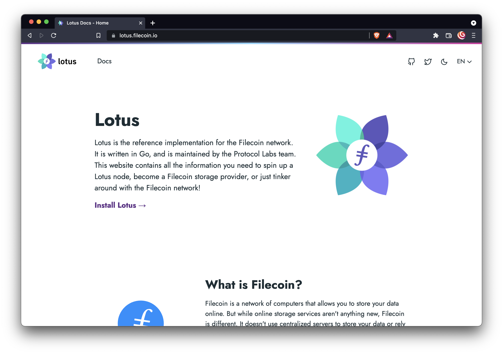
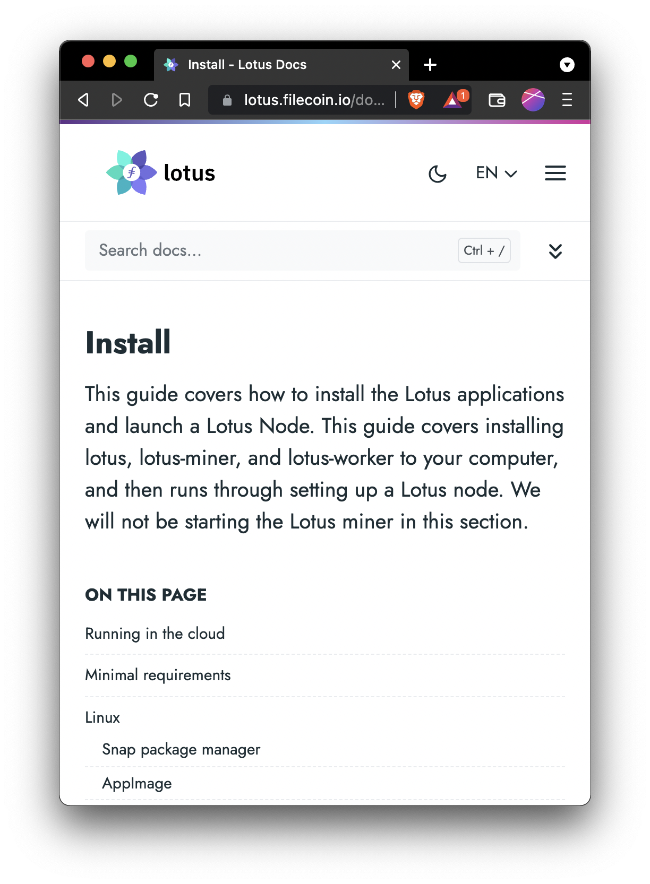

## Features

Here are some super-mega-exciting parts of the site that y’all might enjoy:

### It looks nice

We're obviously biased, but it looks nice and pretty, has a dark theme, and is easy to navigate!

The site is also actually usable on mobile! This doesn’t sound like a significant achievement, but the number of technical docs sites that don’t work (or only half-work) on mobile is shocking.

### Search is useful

When we soft-launched the site last year, a couple of edge-case bugs (i.e. overly aggressive caching) cropped up with the search box now and again. We managed to iron them out with the help of the creator of the [Hugo theme that this site is based on](https://github.com/h-enk/doks).

### Funky progress bar

This is my favorite part. All that happens is a purple bar moves horizontally across the top of the screen as you move down a page. That's literally all it does. While it doesn’t seem like much, having a visual cue like this massively helps readers understand how far they’ve got to go.

> But hey, can’t readers just use the scroll bar in the browser?

Yes. Yes they can. But they don't. Also, some browsers hide scroll bars by default. So we ended up forcing each browser to hide the scroll bar to make things consistent. Once we added the progress bar into the Lotus Docs repo, [we ported it over to the base Doks theme for everyone else to use](https://github.com/h-enk/doks/pull/590)! Open-source software is fun!

### Easy language selection

A lot of Lotus users are not native English speakers. So, with the help of folks over in Filecoin Slack, we’ve started adding Mandarin translations to the Lotus docs. Hugo (the static-site generator we’re using here) makes dealing with translations pretty easy. We’ve even got a handy little dropdown to change languages!

### A basic Lotus explainer

Packed in with this new site is a [stand-alone explainer for what Lotus is](https://lotus.filecoin.io/docs/getting-started/what-is-lotus/) without using any silly words like blockchain, crypto, or web3.

## What's next

Making the API docs look good and easy to use. You'll hear more about that later though.

## So that’s that

We hope you like it! Tell your friends! If you’ve got feedback for this site, drop an [issue in the GitHub repo](https://github.com/filecoin-project/lotus-docs/issues).
