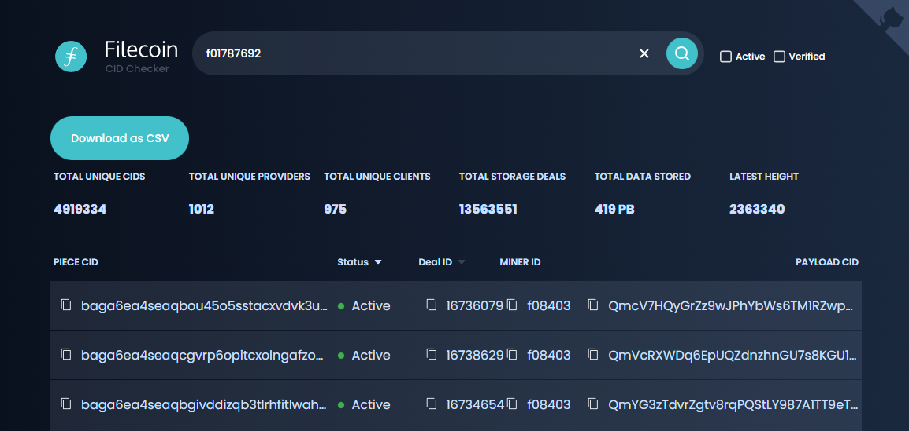
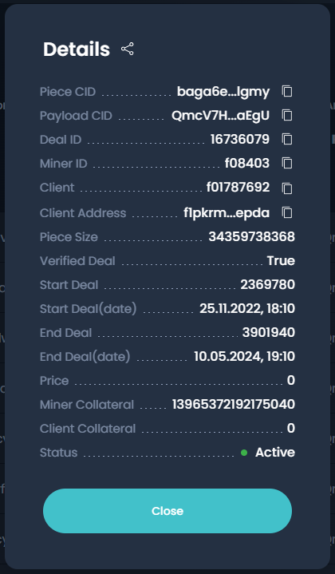


The Legacy Lotus/Lotus-Miner Markets sub-system reached EOL at the [end of the 31st January 2023](https://github.com/filecoin-project/lotus/releases/tag/v1.18.0). It has been fully removed from the Lotus/Lotus-Miner codebase as of 10th June 2024. We recommend our users to use the [Boost markets sub-system](https://github.com/filecoin-project/boost) instead.


Data retrieval is achieved by making a _retrieval deal_ with a _retrieval miner_. In this agreement, the client agrees to pay the miner a certain amount for a given piece of data. This payment happens incrementally as data is received, using a payment channel. Unlike storage deals, retrieval deals happen off-chain.

Currently, Lotus supports direct retrieval from the storage miners which originally stored the data, although, per the network's specification, it is planned to support independent retrieval miners that are specifically dedicated to that business by making retrieval an efficient, fast and reliable operation. At that point, clients will be able to search the network for all possible providers of their desired data (via the DHT, the chain, or out-of-band aggregators), compare deal terms, and chose the best retrieval option for their needs.

In the previous step, you stored some data on the Filecoin network. It takes up to 24 hours for a storage provider to _seal_ the data. If it's been more than 24 hours since you completed the last section, great! If not, don't worry; you can still follow this page to retrieve some example data that's already on the Filecoin network.

## Restart the Lotus

If you closed Lotus or shutdown your computer since you completed the previous section, you'll need to restart the `lotus daemon`.

1. Open a terminal window.
1. Start a Lotus lite-node and connect to `api.chain.love`:

    ```shell
    FULLNODE_API_INFO=wss://api.chain.love lotus daemon --lite
    ```

1. The Lotus daemon will continue to run. You must run further commands from a separate terminal window.

Next up is [checking your balance ↓](#check-address-balance)

## Check address balance

Before you can retrieve data from a storage provider, you need to check that you have enough FIL to pay for the retrieval.

1. List all the addresses on this Lotus lite-node:

    ```shell
    lotus wallet list
    ```

    Lotus will output something like:

    ```shell
    > Address                                    Balance  Nonce  Default
    > f16mwizoeloamhp4dea4uy367mlihddw2mflnb5vy  10 FIL   0      X
    ```

    Any balance above 0.1 FIL is enough to retrieve the data we are requesting in this tutorial.


**Low or no balance**

If you do not have enough FIL, you need to transfer some FIL to this account. You can either do this by using a cryptocurrency exchange or having a friend send you FIL. The address `f1...` listed when you run `lotus wallet list` is your public address; use this when requesting money from an exchange or your friend.


## Get the deal information

Before you can send a retrieval request, you need to collect some information to structure the command. You will need:

| Variable | Description |
| --- | --- |
| Miner ID | This is the ID of the storage provider where the data is stored. |
| Payload CID | This variable is also sometimes called the _Data CID_. |
| Address | The public address that was initially used to create the storage deal. |

We're going to gather this information now.

1. Copy this **address** to your clipboard: `f01787692`.

    If you want to retrieve data that **you stored** you can use your own **address** in place of the one we're using in this tutorial. If you'd like to use the **address** on your local Lotus note, run `lotus wallet list` and copy it to your clipboard.

    Remember, you will not be able to retrieve data stored less than 24 hours ago.

1. Go to [filecoin.tools](https://filecoin.tools).
1. Paste the **address** in the search bar and press `ENTER` to search for deals made by that **address**:

    

    The default **address** supplied in this tutorial `f01787692` has submitted several storage deals so you'll see multiple rows in [filecoin.tools](https://filecoin.tools/f01787692). If you are using a recently created **address**, you may only see a single row. If you don't see _any_ rows, the **address** you searched for has not yet completed a deal. The **address** may have submitted a deal, but the storage provider is yet to _seal_ the data. Deals will only show up here once the storage provider has completed sealing the data.

1. Click anywhere on a row to view information about that specific deal:

    

1. Make a note of the **Payload CID** and the **Miner ID**. You'll need both of these to create the retrieval command in the next step.

## Send a retrieval request

Next up is creating the command for Lotus to run. The structure for a retrieval command is: `lotus client retrieve --provider <MINER ID> <PAYLOAD CID> ~/output-file`

1. Using the template above, create the command substituting `<MINER ID>` and `<PAYLOAD CID>` with the variables you got in the previous step. Your command should look something like this:

    ```shell
    lotus client retrieve --provider f08403 QmcV7HQyGrZz9wJPhYbWs6TM1RZwpuJsgnRCiftHTmaEgU output-file
    ```

    The `output-file` is the name of the file that you'd like to save. You can also add a path to this variable:

    ```shell
    lotus client retrieve --provider f08403 QmcV7HQyGrZz9wJPhYbWs6TM1RZwpuJsgnRCiftHTmaEgU ~/Downloads/filecoin-download.tar
    ```

1. Run the command. After submitting this command, your Lotus lite-node will send the retrieval request to the storage provider and wait for a response:

    ```shell
    > Recv: 0 B, Paid 0 FIL, ClientEventOpen (DealStatusNew)
    > Recv: 0 B, Paid 0 FIL, ClientEventDealProposed (DealStatusWaitForAcceptance)
    > Recv: 0 B, Paid 0 FIL, ClientEventDealAccepted (DealStatusAccepted)
    > ...
    ```

1. Wait for the process to finish:

    ```shell
    > Recv: 66.33 KiB, Paid 0.00000000000013584 FIL, ClientEventPaymentSent (DealStatusFinalizing)
    > Recv: 66.33 KiB, Paid 0.00000000000013584 FIL, ClientEventComplete (DealStatusFinalizingBlockstore)
    > Recv: 66.33 KiB, Paid 0.00000000000013584 FIL, ClientEventBlockstoreFinalized (DealStatusCompleted)
    Success
    ```

    You must keep the `lotus daemon` running for the duration of this process.

1. That's it!

This marks the end of the Filecoin Store and Retrieve tutorial! By now you should have a good understanding of how the storage and retrieval process works on the Filecoin network, and also have some ideas on how to integrate this process into your projects! Feel free to carry on playing around with storing and retrieving data using Lotus and Filecoin. If you need a hand or get stuck, check out the Filecoin Slack for help.


If you added a CAR file serializing an IPLD-DAG with a format that cannot be readily turned into a file (i.e. anything non unixfs), pass the `--car` flag and deserialize your DAG manually as needed.

