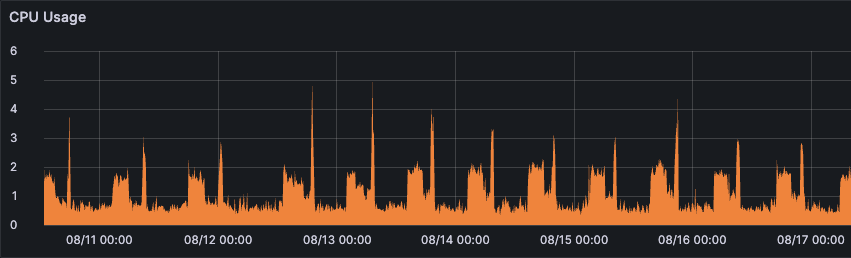
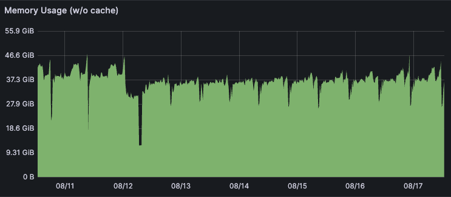

## Pretext

Joining the Filecoin network requires knowledge of existing peers in the network. On startup Lotus, as well as other
implementations, attempt to retrieve peer information from a known set of bootstrap nodes.

At present, these known bootstrap nodes are [included in](https://github.com/filecoin-project/lotus/blob/master/build/bootstrap/mainnet.pi) Lotus releases, but the list is also configurable at runtime.

Lotus is currently the only known filecoin implementation offering bootstrap functionality.

## Motivation

Without bootstrap nodes, it would be impossible to join the network, hence they are invaluable to network health.

There is currently no monetary gain in running a bootstrap node.

## Requirements

While it’s possible to synchronise a Lotus node with relatively low resources, and operate a bootstrap node with
marginally more resources, it’s important to ensure that a bootstrap node is able to stay synchronised with the
network while also serving an unpredictable number of bootstrap requests.

It’s possible to reliably synchronise a bootstrap node with as few as 3 cores and 5Gb real memory, but you will need
to monitor resource usage closely in periods of high demand, and account for additional disk space for virtual memory.

To demonstrate the resource requirements of a bootstrap node, see a 7 day window of cpu and memory profiles of one
bootstrap node on the network.



## Configuration
We recommend the following configuration to be specified for running a bootstrap node.
```toml
  [API]
    ListenAddress = "/ip4/0.0.0.0/tcp/1234/http"
  [Libp2p]
    ListenAddresses = ["/ip4/0.0.0.0/tcp/1347"]
    ConnMgrLow = 400
    ConnMgrHigh = 500
    ConnMgrGrace = "5m0s"
  [Pubsub]
    Bootstrapper = true
    IPColocationWhitelist = ["10.0.0.0/8"]
```


Lotus API's `ListenAddress` should be a multiaddress which allows Lotus to listen on the desired interface,
e.g. `0.0.0.0` for all ipv4 addresses on this host.

Libp2p's `ListenAddresses` should be configures similarly. 

Given the traffic demands of a bootstrap node, we recommend tuning the connection parameters to a less
aggressive threshold, allowing 400-500 connections with a connection timeout of 5 minutes.

If you intend to run a bootstrap node behind a reverse proxy or load balancer, you will need to configure
`IPColocationWhitelist` to cover your IPs. This is because libp2p currently does not support proxy protocol,
therefore all peers will register as the reverse proxy/load balancer address, causing peer penalties to be inccorectly
applied (see
[gossipsub-v1.1.md](https://github.com/libp2p/specs/blob/50db89f3a71a87b096b0994a43a2dce0d251aeec/pubsub/gossipsub/gossipsub-v1.1.md?plain=1#L322)).

## Unlisted bootstrap nodes
Bootstrapper nodes will automatically bootstrap with known bootstrappers. If you are operating your own
infrastructure, you may want to manually connect your bootstrap nodes to each other.

```shell
lotus net peers
lotus net connect <peer_multiaddr>
```

## Configure lotus daemons to connect to this bootstrapper.

Lotus bootstrappers are built in at compile time. You can find the list of public bootstrapper nodes for
each network [here](https://github.com/filecoin-project/lotus/tree/master/build/bootstrap). This list can be overridden by adding the following to your daemon config file.

```toml
[Libp2p]
    BootstrapPeers = [
      "<multiaddr>"
    ]
```

## For prospective operators
If you're running a bootstrap node, and wish to join the known bootstrap nodes list, please get in touch over in the [#fil-lotus-help](https://filecoinproject.slack.com/archives/CPFTWMY7N) channel on Slack.