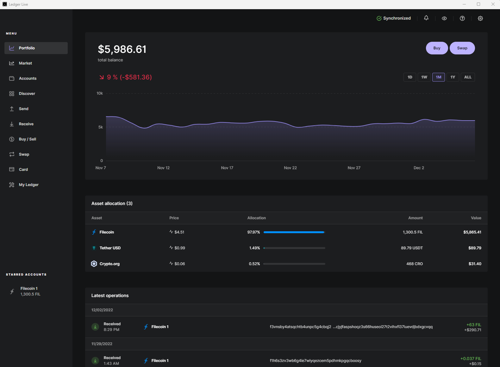

[Filecoin is now available on Ledger Live!](https://filecoin.io/blog/posts/zondax-brings-filecoin-to-ledger-live/) Clients, Storage Providers, and other network participants can send and receive FIL directly from Ledger devices while their private keys remain secure and are never exposed to third parties.

Before you select a wallet, setup your Ledger device.

## Setup your Ledger device

1. Install [Ledger Live](https://www.ledger.com/start/) and follow the instructions to set up your device.

   
   Linux users may need to add the [necessary udev rules](https://support.ledger.com/hc/en-us/articles/115005165269-Fix-USB-connection-issues-with-Ledger-Live?support=true)
   

1. Navigate to the Ledger Live dashboard.

1. Select **My Ledger** in the left-hand menu pane:

   

1. After approving the request to allow **Ledger Manager** on your Ledger device, search for and install the **Filecoin** app.

Now that you've setup your ledger device, select your wallet UI option.

## Ledger Wallet UI Options

You can either manually manage your funds using the [Lotus node and Ledger integration](#lotus) or use the [browser-based Glif wallet](#glif-wallet).

### Using Lotus

To use a Filecoin Lotus node with Ledger hardware to manage your funds, add your Ledger to a Lotus node.

#### Add your Ledger to a Lotus node


Ensure that you fully trust the Lotus node you are connecting to.


1. Navigate to `~/.lotus/config.toml`.
1. In the Lotus configuration file, remove "#" and set `EnableLedger = true` in the `[Wallet]` section:

   ```toml
   [Wallet]
     EnableLedger = true
   ```

1. Unlock your Ledger device.
1. Open the Filecoin app on your Ledger device and keep it connected to your computer.
1. Create a Ledger-backed (`secp256k1-ledger`) wallet using the `lotus wallet` command:

   ```shell
   lotus wallet new secp256k1-ledger
   ```

   Calling `lotus wallet new secp256k1-ledger` will provide a new Ledger-backed key whenever called. When called on a different Lotus node or in one that has been reset, the same keys will be generated as they are based on the Ledger device master key.

1.  On your Ledger device, confirm the creation of the wallet.

**From this point, any [FIL send operation](#sending-fil) from a Ledger wallet must be approved on the Ledger device.** Ensure that the Ledger device is connected, unlocked, and running the Filecoin app when performing any FIL send operation.



The `lotus-shed` application provides additional Ledger functionality, like listing the keys in the device and providing information about them.


### Using Glif Wallet

Previously, Ledger Live users were required to install Glif Wallet to store FIL. The Ledger Live integration launched by Zondax is a convenient alternative where holders can enjoy the same benefits within the Ledger Live app without the need for a browser-based solution.

The Glif wallet integration is still available at [glif.io](https://www.glif.io/en). Glif is an open-source, browser-based Filecoin wallet. It uses the [Filecoin Ledger integration library](https://github.com/Zondax/ledger-filecoin/), which has been security audited by a third-party.
