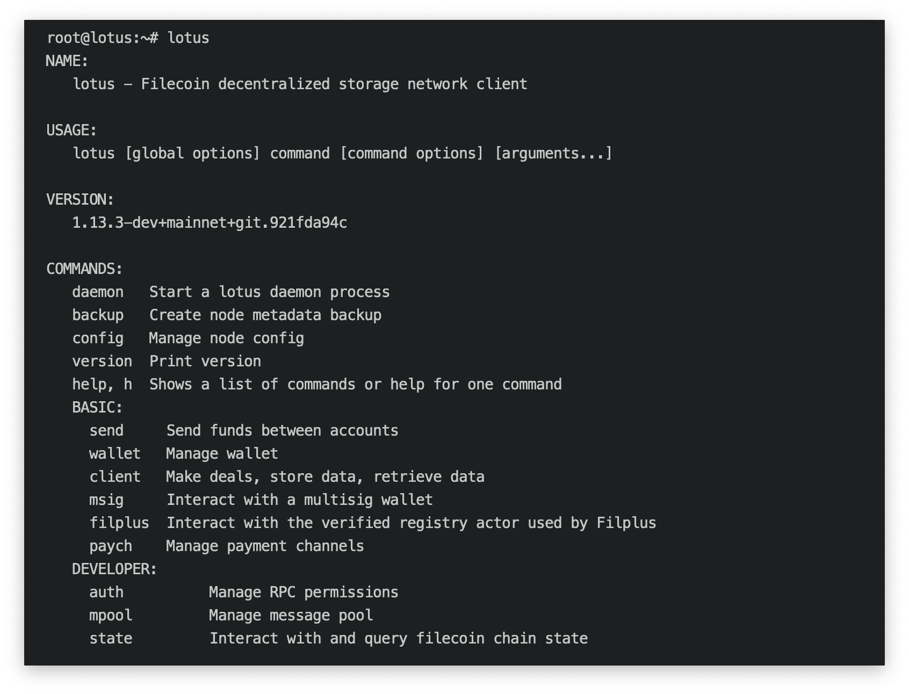

This section contains reference information for the Lotus API and CLI. Most commands found within the CLI have an equivilent in the API. 

## API basics

To use the Lotus API you must either have a local `lotus-daemon` running, or be connected to a remote Lotus node.

- Learn about the [different types of Lotus node]()
- Learn about remote [Glif nodes]()
