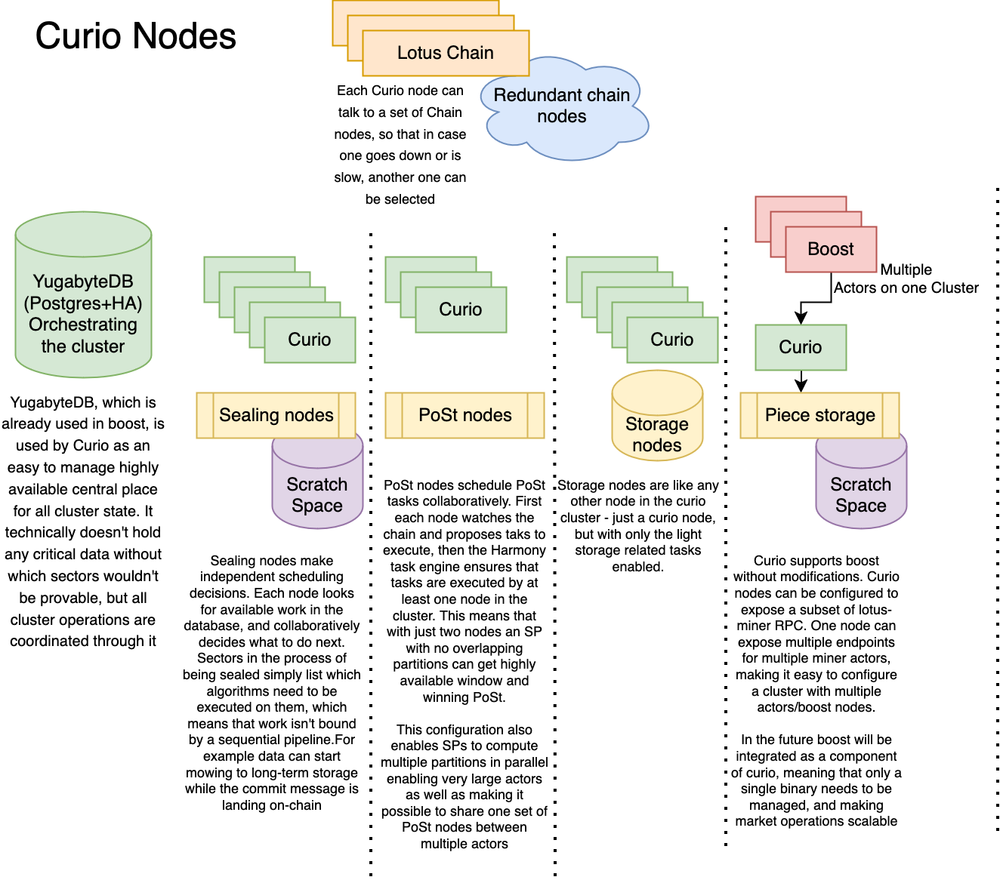
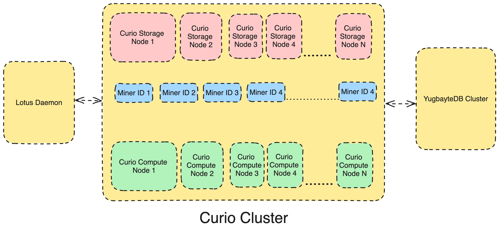
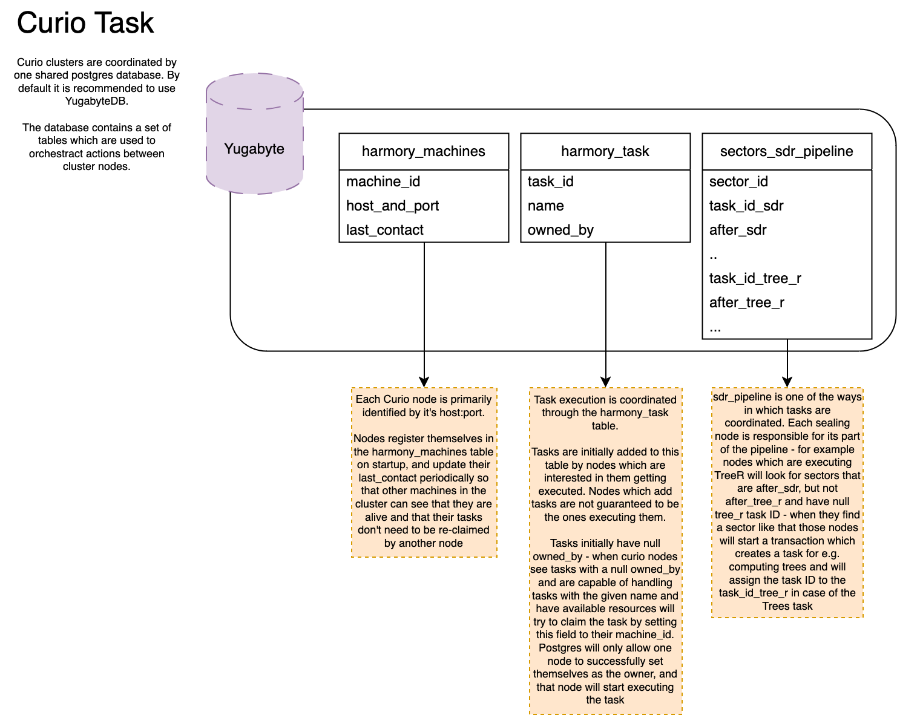

# Curio
The core component of Curio are HarmonyDB, HarmonyTask, ChainScheduler and some abstraction of configuration & storage.

A Curio cluster is a cluster of multiple Curio nodes connected to a YugabyteDB cluster and market nodes.
A single Curio cluster can serve multiple miner ID and share the computation resources between them as required.

## HarmonyDB
HarmonyDB is a simple SQL database abstraction layer used by HarmonyTask and other components of the Curio stack to store and retrieve information from YugabyteDB.

### Key Features:
- **Resilience:** Automatically fails over to secondary databases if the primary connection fails.
- **Security:** Protects against SQL injection vulnerabilities.
- **Convenience:** Offers helper functions for common Go + SQL operations.
- **Monitoring:** Provides insights into database behavior through Prometheus stats and error logging.

### Basic Database Details
- The Postgres DB schema is called "curio" and all the harmony DB tables reside under this schema.
- Table `harmony_task` stores a list of pending tasks.
- Table `harmony_task_history` stores completed tasks, retried tasks exceeding limits, and serves as input for triggering follower tasks (potentially on different machines).
- Table `harmony_task_machines` is managed by lib/harmony/resources. This table references registered machines for task distribution. Registration does not imply obligation, but facilitates discovery.

## HarmonyTask

The HarmonyTask is pure (no task logic) distributed task manager.

### Design Overview

- Task-Centric: HarmonyTask focuses on managing tasks as small units of work, relieving developers from scheduling and management concerns.
- Distributed: Tasks are distributed across machines for efficient execution.
- Greedy Workers: Workers actively claim tasks they can handle.
- Round Robin Assignment: After a worker claims a task, HarmonyDB attempts to distribute remaining work among other machines.

### Model

- **Blocked Tasks:** Tasks can be blocked due to:
    - Missing registration on running servers
    - Reaching specified maximum task limits
    - Resource exhaustion
    - CanAccept() function (task-specific) rejecting the task

- **Task Initiation:** Tasks can be initiated through:
    - Periodic database reads (every 3 seconds)
    - Addition to the database by the current process

- **Task Addition Methods:**
    - Asynchronous listener tasks (e.g., for blockchains)
    - Follower tasks triggered by task completion (sealing pipeline)

- **Duplicate Task Prevention:**
    - The mechanism for avoiding duplicate tasks is left to the task definition, most likely using a unique key.

## Distributed Scheduling
Curio implements a distributed scheduling mechanism co-ordinated via the HarmonyDB. The tasks are picked by the Curio nodes based on what they can handle (type and resources).
Nodes will avoid taking additional tasks if they already have an active task even if they have additional resources to accommodate the said additional task.
This ensures a more even scheduling of the tasks.

### Chain Scheduler
The `CurioChainSched` or the chain scheduler trigger some call back functions when a new TipSet is applied or removed. This is equivalent to getting the heaviest TipSet on each epoch.
These callback function in turn add the new tasks for each type that depends on the changes in the chain. These task types are WindowPost, WinningPost and MessageWatcher.

### Poller
Poller is a simple loop that fetches pending tasks periodically according to predefined durations (100ms), or until a graceful exit is initiated by the context.
Once the pending tasks are fetched from the database, it attempts to schedule all the tasks on the Curio node. This attempt will result in one of the following results:
1. Task is accepted
2. Task is not scheduled as machine is busy
3. Task is not accepted as machine handle the specified Task

If the task is accepted during a polling cycle, the wait time before the next cycle is equal to 100ms. But if the task is not scheduled for any reason the poller will retry after 3 seconds.
Also, if the elapsed time since the last follow-up of tasks in the database exceeds FOLLOW_FREQUENCY, the followWorkInDB function is called.

### Task Decision Logic
For each task type a machine can handle, it first checks if the machine has enough capacity to execute the said task.
Then it queries the database for tasks with no `owner_id` and the same name as the task type. If such tasks are present, it attempts to accept their work.
It returns true if any work has been accepted and false otherwise. The decision-making logic to accept each task is following:

1. Checks if there are any tasks to do. If there are none, returns true.
2. Checks if the maximum number of tasks of this type is reached. If the number of running tasks meets or exceeds the maximum limit, log a message and returns false.
3. Checks if the machine has enough resources to handle the task. This includes checking the CPU, RAM, GPU capacity, and available storage. If the machine does not have enough resources, log a message and return false.
4. Checks if the task can be accepted by calling the `CanAccept` method. If it cannot be accepted, log a message and return false.
5. If the task requires storage space, the machine attempts to claim it. If the claim fails, log a message and releases the claimed storage space, then return false.
6. If the task source is `recover` i.e. the machine was performing this task before shutdown then increase the task count by one and begin processing the task in a separate goroutine.
7. If the task source is `poller` i.e. new pending task, attempt to claim the task for the current hostname. If unsuccessful, release the claimed storage and attempt to consider the next task.
8. If successful, increase the task count by one and begin processing the task in a separate goroutine.
9. This goroutine also updates the task status in the task history and depending on whether the task was successful or not, either deletes the task or updates the task in the tasks table.
10. Returns true, indicating that the work was accepted and will be processed.

