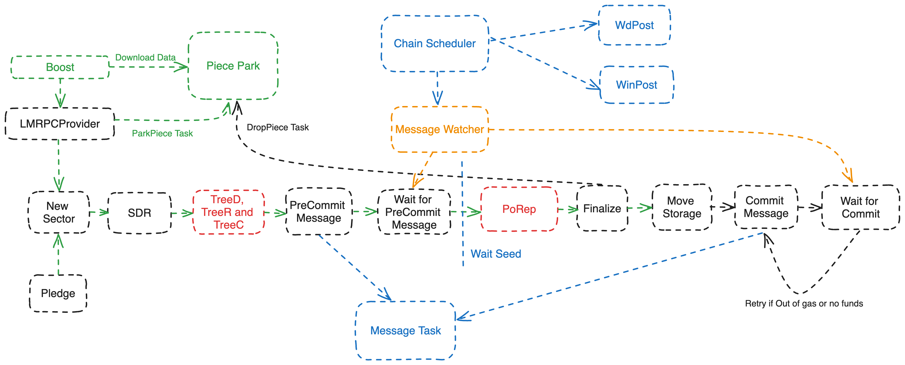
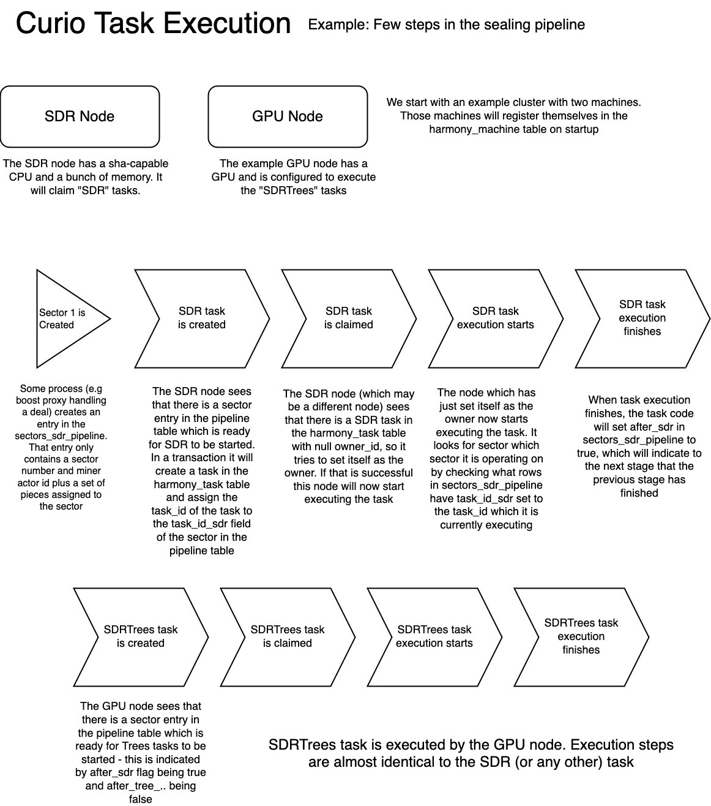

## Sealing Pipeline
Curio's sealing process is powered by HarmonyTasks. Each stage involved in sealing a sector is divided into smaller, independent tasks.
These individual tasks are then picked up by different machines within the Curio cluster.
This ensures tasks are distributed effectively and resources are used efficiently across the entire system.




### SealPoller

The SealPoller struct is designed to track the progress of sealing operations. Each possible state in the sealing workflow is represented by a pollTask struct.
This struct tracks each step a sealing operation might be in by setting boolean flags and saving task ids in individual columns of the `sectors_sdr_pipeline` table within the harmony database.

```text
type pollTask struct {
	SpID         int64 `db:"sp_id"`
	SectorNumber int64 `db:"sector_number"`

	TaskSDR  *int64 `db:"task_id_sdr"`
	AfterSDR bool   `db:"after_sdr"`

	TaskTreeD  *int64 `db:"task_id_tree_d"`
	AfterTreeD bool   `db:"after_tree_d"`

	TaskTreeC  *int64 `db:"task_id_tree_c"`
	AfterTreeC bool   `db:"after_tree_c"`

	TaskTreeR  *int64 `db:"task_id_tree_r"`
	AfterTreeR bool   `db:"after_tree_r"`

	TaskPrecommitMsg  *int64 `db:"task_id_precommit_msg"`
	AfterPrecommitMsg bool   `db:"after_precommit_msg"`

	AfterPrecommitMsgSuccess bool   `db:"after_precommit_msg_success"`
	SeedEpoch                *int64 `db:"seed_epoch"`

	TaskPoRep  *int64 `db:"task_id_porep"`
	PoRepProof []byte `db:"porep_proof"`
	AfterPoRep bool   `db:"after_porep"`

	TaskFinalize  *int64 `db:"task_id_finalize"`
	AfterFinalize bool   `db:"after_finalize"`

	TaskMoveStorage  *int64 `db:"task_id_move_storage"`
	AfterMoveStorage bool   `db:"after_move_storage"`

	TaskCommitMsg  *int64 `db:"task_id_commit_msg"`
	AfterCommitMsg bool   `db:"after_commit_msg"`

	AfterCommitMsgSuccess bool `db:"after_commit_msg_success"`

	Failed       bool   `db:"failed"`
	FailedReason string `db:"failed_reason"`
}
```

The SealPoller retrieves all the `pollTasks` from the database, for which `after_commit_msg_success` or `after_move_storage` is not true, and tries to advance their state if possible.
A `pollTask` is advanced when its dependencies, indicated by the "after_" fields, are completed and the task itself is not yet queued (its task id is nil) or completed (its "After" field is false).
Each pollTask's advancement will trigger a database transaction attempting to update the task id with the new task id received from the HarmonyDB.
The transaction makes sure that the task hasn't been queued by others between reading the state and updating the task id.
This polling process happens sequentially with different conditions for each stage, ensuring that all previous conditions are fulfilled before proceeding.
If a task cannot proceed due to its previous dependencies not being completed, the poller will come back in the next round.
Mostly, errors occurring during the poller operation are logged and don't cause the poller to stop. But if something serious happens during a database transaction, it will be rolled back, with an error message giving details.
By organizing work in this way, SealPoller ensures that each step in the sealing procedure occurs in the correct order, and that progress is made whenever it is possible to do so.
It allows sectors to be sealed as efficiently as possible given the constraints of other tasks in progress.



### Piece Park

Traditionally, data needs to be available before it can be sealed for storage. However, this can lead to inefficiencies. Curio addresses this by introducing a "Piece Park."
Curio's sealing pipeline does not require the data to be readily available upfront. This allows us to initiate the sealing process even before the data is downloaded.
While the sealing process progresses, the data is "parked" in a designated directory called "piece" within the storage location.
This avoids keeping market connections open for extended periods. In essence, the local piece park acts as a temporary holding area for data, streamlining the sealing process and optimizing resource usage.

Curio utilizes two tasks:
ParkPiece: This task handles downloading the data and placing it in the "piece" directory.
DropPiece: Once the data is no longer needed, this task takes care of cleaning up the parked data.

In the future, this local storage can also allow Curio to reseal data in a new sector if the original sector gets lost during the sealing process.

### LMRPCProvider

The LMRPCProvider provides a set of methods to interact with various data related to sectors and pieces. These methods are required by market implementation (Boost) to track the sealing progress of a deal.
```text
ActorAddress: This method returns the actor's address associated with the LMRPCProvider. In other words, it returns the miner's address.
WorkerJobs: This function returns a map of worker jobs, indexed by UUID.
SectorsStatus: This method returns the status of a sector given the sector identifier sid. This function includes detailed information about the sector such as the state of sealing, deal ids, log, pledge, and expiration etc.
SectorsList: This function provides a list of sector numbers currently stored.
SectorsSummary: This function gives a summary of the sectors, categorized by their state. It returns a map that maps each sector state to its count.
SectorsListInStates: This method returns a list of sector numbers that are in a given set of states.
ComputeDataCid: This function is used to compute the CID of the data.
AuthNew: This function creates a new authorization token (JWT) for the given permissions.
```

### Piece Ingester
The Piece Ingestor allocates a piece to a sector for a given miner address.
It checks if the piece size matches the sector size, determines the preferred seal proof type, retrieves the miner ID, allocates a sector number,
inserts the piece and sector pipeline entries into the database, and returns the sector and offset of the allocated piece.
