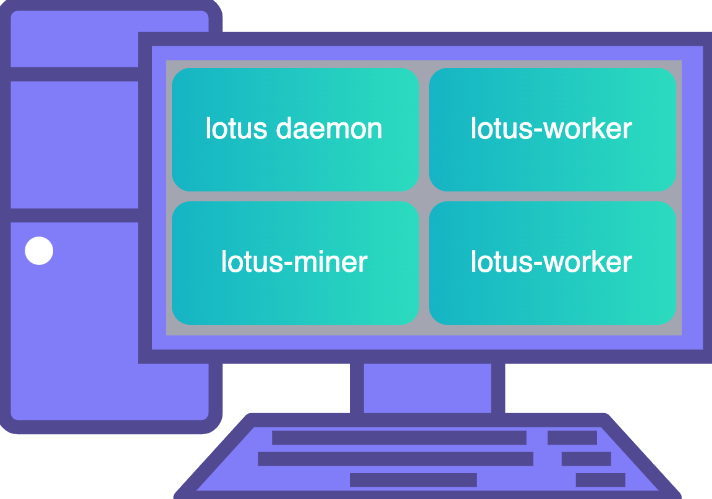
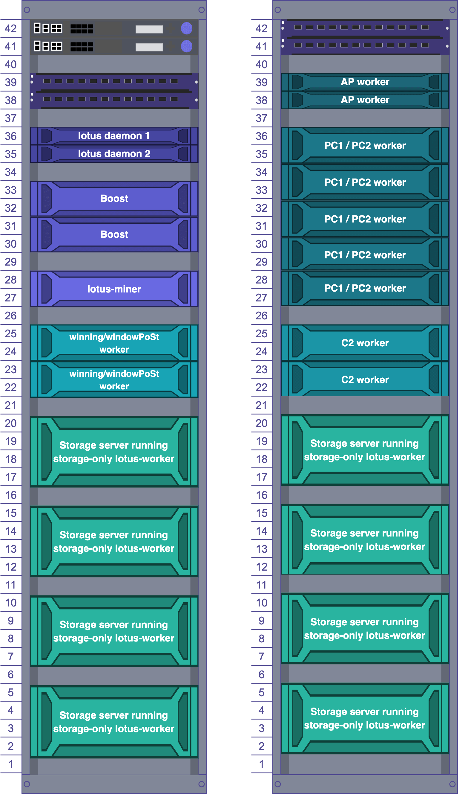

## Community architectures

Hardware requirements and architecture suggestions constantly evolve based on market demands and available hardware. Because of this, we aren't listing any specific hardware recommendations.


If you want to highlight your organizations architecutral storage provider setup, please create a pull request with a link to your architecture. [Lotus-docs Github](https://github.com/filecoin-project/lotus-docs/pulls)!


### Enterprise architechtures

This discussion is ongoing and frequently updated with the new recommendation from community storage providers.

## SME architechtures

- Some smaller and medium [storage provider profiles and architectures](https://github.com/filecoin-project/lotus/discussions/6071) is listed in the Lotus project GitHub discussions.
- Benjamin Hoejsbo recently gave a presentation on how to create a solo storage provider set up. [Check out the video on YouTube](https://www.youtube.com/watch?v=LKMjCgo-fkA).
