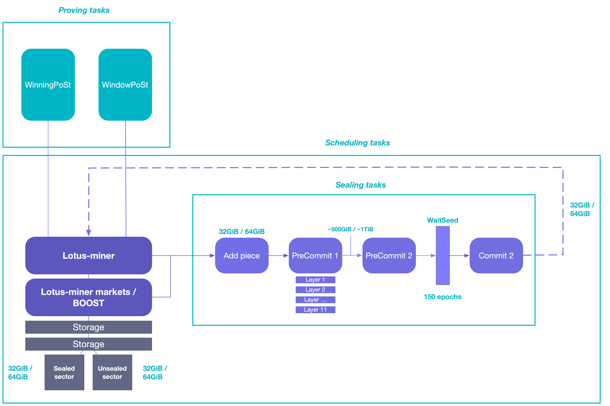

This guide provides a high-level overview of the core tasks undertaken by the `lotus-miner` daemon and its sub-components.

## Tasks

We can split the tasks the `lotus-miner` daemon and its sub-components are responsible for into three categories.

**Sealing tasks**: Before a sector can be commited to network, the storage provider *must* seal the sector, meaning it needs to encode the data in the sector to prepare it for the proving tasks. Sealing a sector is a multi-step process and is time-intensive to create, because the encrypted version of each chunk of data depends on every other chunk of input data.

Snap-Deal sealing tasks are covered in a separate dedicated guide in the operate section.

**Proving tasks**: These tasks allow storage providers to verifiably prove they have the data they have commited to the network on disk.

**Scheduling tasks**: These are background tasks for controlling and optimizing work across all the sub components of `lotus-miner`. Since Lotus is highly configurable and many of the `lotus-miner` sub-components can be split into separate machines, scheduling work efficiently and securely is important.

 

### Add piece

Add piece is the task where deal data, and padding if required, is written to a sector. A sector will be left open and waiting for more deal data until it´s full, then it will move on to the PreCommit 1 task. If no sectors with enough space are open when a `Add piece` task happens, a new sector will be created.

### PreCommit 1

The PreCommit 1 task is the first phase of the Proof-of-Replication process and is where encoding and replication of the data takes place. The PreCommit 1 task is predominantly using a single CPU core, and is heavily utilizing the SHA256 instruction set. Using a CPU that have the SHA256 instruction set is therefore recommended.

All 11 layers of calculation, layer by layer, are calculated sequentially. Each layer is 32GiB in size. When the PreCommit 1 process is finished you will have generated data to the amount of 384GiB (A 32GiB unsealed sector + (11 layers x 32GiB))

### PreCommit 2

In the PreCommit 2 task, a column hash computation based on the 11 layers generated in PreCommit 1 is calculated, and a merkle tree gets constructed. These tasks can either be done by the CPU or accelerated by using a GPU.

During this phase an additional 64GiB file (32GiB sectors) that represents the merkle tree is stored, in addition to the sealed 32GiB sector. Bringing the total amount of storage needed to approximately 500 GiB for one sector.

### WaitSeed

The WaitSeed state is a security wait requirement by the network that is initiated between the PreCommit 2 and the start of the Commit 1 phase. It is fixed at 150 epochs, i.e 75 minutes long. At the end of the wait seed state the sector aquires some randomness from the chain.

### Commit 1

The randomness aquired at the end of the wait seed state is used in the Commit 1 phase to select a random subset of leaf nodes from the merkle tree generated in the PreCommit 2 phase. From the subset of leaf nodes it checks, it generates a much smaller file than the full merkle tree. That file is is approximately 16MiB in size.

### Commit 2

In the Commit 2 phase, the file from the Commit 1 gets compressed into a much smaller proof using zk-SNARKs. The proof generated at the end of Commit 2 can be verified that is correct very fast, and is small enough to be suitable for a blockchain. The final size of the proof is approximately 2kib, and gets published on the blockchain. The generation of the zk-SNARK can be done by the CPU or accelerated by using a GPU.

### windowPoSt

Window Proof-of-SpaceTime (WindowPoSt) is a proving task where the storage provider is asked to compute a proof that they are actually storing the data they have commited to the network. Every 24-hour period is broken into a series of windows, where each window is 30 minutes long. In a given window, a storage provider is asked to generate a proof based on random parts of the sealed sectors the storage provider has in that window. If they don’t have the data anymore, they won’t be able to respond with their proof in time, and will be penalized.

In this way, every sector is audited at least once in any 24-hour period, and a permanent, verifiable, and public record attesting to each storage providers continued commitment is kept.

### winningPoSt

Winning Proof-of-SpaceTime (WinningPoSt) is the mechanism by which storage providers are rewarded by the Filecoin network for their contributions to it. As a requirement for doing so, each storage provider is tasked with submitting a compressed Proof-of-Spacetime for a specified sector. Each elected storage provider who successfully creates a block is granted FIL, as well as the opportunity to charge other Filecoin participants fees to include messages in the block.

Storage providers who fail to do this in the necessary window will forfeit their opportunity to mine a block.

## Tips

### Safely restarting the lotus-miner daemon

The process of shutting down a storage provider and starting it again is complicated. Several factors need to be taken into account to be able to do it with all the guarantees:

- How long the storage provider plans to be offline.
- The existence and distribution of proving deadlines for the storage provider.
- The presence of open payment channels and ongoing retrieval deals.
- The occurrence of ongoing sealing operations.

### Reducing time offline

Given the need to continuously send proofs to the network, a storage provider should be offline as little as possible. Offline-time includes the time it takes for the server to restart the `lotus-miner` daemon fully.
