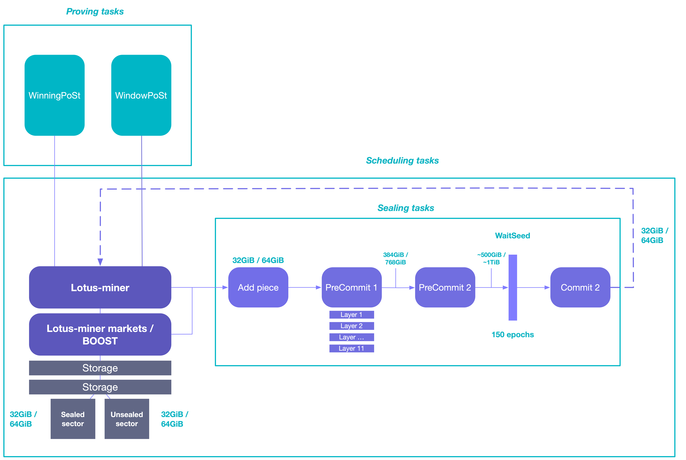

This guide goes through the core tasks the lotus-miner application is responsible for, it aims to be a high level overview and to act as a good entry point to understand the 

## Key concepts

### Sectors
A sector is the default unit of storage that storage providers add to the Filecoin network. Storage providers can decide if they want to use 32 GiB sector sizes or 64 GiB sector sizes when they initialize their storage provider. It´s not possible to change the sector size after it has been initialized on-chain.

A sector can contain data from multiple deals and multiple clients. A storage provider can also add "Commited Capacity" (CC) sectors, which is sectors that has been made avaialble to the Filecoin network, but for which storage deals has not been agreed upon yet. These commited capacity sectors can be upgraded to include storage deals later in a process called Snap Deals.

**Sealed sectors**
A sealed sector is a sector that has gone through all the sealing tasks to be encoded to prepare it for the proving tasks.

**Unsealed sectors**
A unsealed sector is the raw data. Some clients request that their unsealed data is kept for fast retrievals.

## Scheduling tasks

## Sealing tasks

### Add piece

### PreCommit 1

### PreCommit 2

### WaitSeed

### Commit 1

### Commit 2

## Proving tasks

### windowPoSt
Window Proof-of-SpaceTime (WindowPoSt) is a proving task where the storage provider is asked to compute a proof that they are actually storing the data they have commited to the network. Every 24-hour period is broken into a series of windows, where each window is 30 minutes long. In every window 

In this way, every sector is audited at least once in any 24-hour period, and a permanent, verifiable, and public record attesting to each storage providers continued commitment is kept.

### winningPoSt
Winning Proof-of-SpaceTime (WinningPoSt) is the mechanism by which storage providers are rewarded by the Filecoin network for their contributions to it. As a requirement for doing so, each storage provider is tasked with submitting a compressed Proof-of-Spacetime for a specified sector. Each elected storage provider who successfully creates a block is granted FIL, as well as the opportunity to charge other Filecoin participants fees to include messages in the block.

Storage providers who fail to do this in the necessary window will forfeit their opportunity to mine a block.

## Reducing time offline
Given the need to continuously send proofs to the network, a storage provider should be offline as little as possible. Offline-time includes the time it takes for the server to restart the `lotus-miner` daemon fully.
