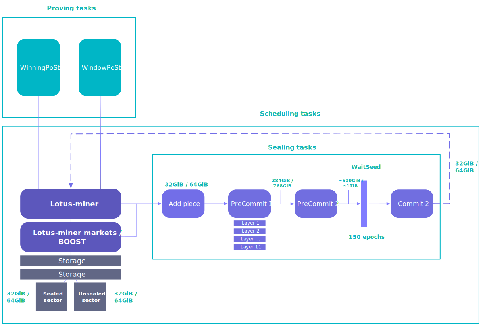

## Key concepts

### Sectors
A sector is the default unit of storage that storage providers adds to the Filecoin network. Storage providers can decide if they want to use 32 GiB sector sizes or 64 GiB sector sizes when they initialize their storage provider. It´s not possible to change the sector size after it has been initialized it on-chain.

## Scheduling tasks

## Sealing tasks

### PreCommit 1

### PreCommit 2

### WaitSeed

### Commit 1

### Commit 2

## Proving tasks

### windowPoSt
Window Proof-of-SpaceTime (WindowPoSt) is a proving task where the storage provider is asked to compute a proof that they are actually storing the data they have commited to the network. Every 24-hour period is broken into a series of windows, where each window is 30 minutes long.

### winningPoSt