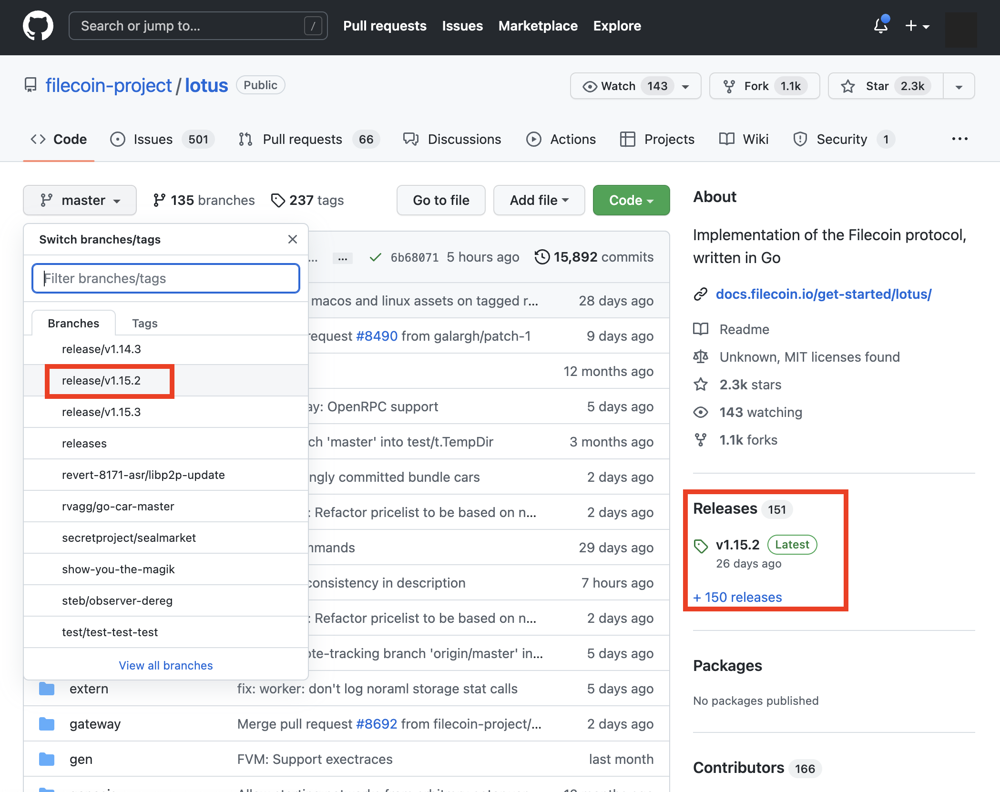

## Set up on mainnet

Before you begin storing any data on the Filecoin network, you need to run through a few steps to get everything set up. This section covers getting access to a Lotus full-node on a test network (known as calibnet), creating a Lotus lite-node on your computer, getting a FIL address (wallet), adding FIL to that wallet, and signing up for Filecoin+.


Programs that interact with the Filecoin network are called _implementations_, and Lotus is a command-line interface (CLI) implementation. There are other implementation being created alongside Lotus, however Lotus is the only Filecoin implementation created and maintained by Protocol Labs.


### Things to note

As you're going through this section, make a note of the following variables:

| Variable | Description | Example |
| --- | --- | --- |
| Your Filecoin address | The public part of your Filecoin address. This address is what other users can use to send your FIL. | `f1fwavjcfb32nxbczmh3kgdxhbffqjfsfby2otloi` |

## Prerequisites

To install the calibnet version of Lotus, you will need to build from source, and have the following installed on your computer:

* [go version 1.16 or above](https://go.dev/doc/install)
* [Install rustc and other dependencies](https://github.com/rust-lang/rustup/blob/master/rustup-init.sh) with `rustup init`
* [Homebrew](https://brew.sh/) should be installed on your Mac along with XCode
* Check the [lotus Gihthub repository](https://github.com/filecoin-project/lotus) and note the branch for the latest release

<!--  -->


### Access a full-node

A Lotus full-node is a computer running the `lotus daemon`. Full-nodes are unique because they have complete access to a Filecoin blockchain. The hardware required to run a Lotus full-node are relatively high and might be out of reach for most end-user laptops and PCs.

Usually, we'd have to _spin up_ a full-node, but for this tutorial we're going to use a Lotus [full-node testnet endpoint maintained by Glif](https://lotus.filecoin.io/developers/glif-nodes/#testnet-endpoint). This node, called `api.node.glif.io`, is only for practice sessions like this tutorial and should not be relied upon for any production or development purposes.

## Install a lite-node

A lite-node lets your computer interact with the Filecoin network without having to run a resource-intensive full-node! Lite-nodes can do things like sign messages and talk to storage providers, but any processes that need data from the blockchain must come from a full-node.

For this tutorial, you're going to install a Lotus lite-node from binary on your local computer and have it connect to a full-node managed by Protocol Labs.

To install a Lotus lite-node on your computer, you must have the tools required to _build_ a Lotus binary from the GitHub repository, listed in the prerequisites above.

### MacOS, Ubuntu, or Powershell

To run calibnet, you will need to install the binary and build from source on MacOS, Ubuntu, or using Windows Powershell

1. If you already have another version of lotus installed, switch into a different directory to install the version for calibnet:

  ```shell
  mkdir calibnet-folder
  cd calibnet-folder
  ```

1. Clone the Lotus repository and move into the `lotus` folder:

  ```shell
  git clone https://github.com/filecoin-project/lotus/<releases/version>
  cd lotus
  ```


  **Run on a different $LOTUS_PATH** -  If you have installed Lotus for mainnet and are switching to calibnet (but you want to keep all your mainnet data intact for when you switch back), change your $LOTUS_PATH before running or building the lotus daemon:

  To change your $LOTUS_PATH run: export LOTUS_PATH=~/.new-lotus-path. 
  </br >

1. Build the `lotus` executable:

```shell
make clean calibnet
```


## Run a Lotus lite-node

Now that you have Lotus ready to run, you can start a Lotus lite-node on your computer and connect to the `api.node.glif.io` Lotus full-node!


Just as a reminder, `api.node.glif.io` is a Lotus full-node managed by Protocol Labs. It's ideal for use in this tutorial, but should not be used in a development or in a production environment.


1. Open a terminal window and run the `lotus daemon --lite` command, using `api.node.glif.io` as the full-node address:

    ```shell with-output
    FULLNODE_API_INFO=https://api.node.glif.io lotus daemon --lite
    ```

    ```
    ...
    2021-06-16T02:00:08.390Z        INFO    markets loggers/loggers.go:56   module ready   {"module": "storage client"}
    2021-06-16T02:00:08.392Z        INFO    markets loggers/loggers.go:56   module ready   {"module": "retrieval client"}
    2021-06-16T02:00:18.190Z        INFO    basichost       basic/natmgr.go:91      DiscoverNAT error:no NAT found
    ...
    ```

1. MacOS users may see a warning regarding Lotus. Select **Accept incoming connections** if you see a warning.
1. The Lotus daemon will continue to run. You must run further commands from a separate terminal window.

Next up is [getting a FIL address ↓](#get-a-fil-address)

## Get a FIL address

Filecoin addresses are similar to regular bank account numbers. Other users can use your address to send you FIL, and you can use your address to pay storage providers for storing and retrieving your data.

There are two parts to a Filecoin address: the public address and the private key. You can freely share your public address with anyone, but you should never share your private key. We're not going to view any private keys in this tutorial, but it's essential to understand the difference between your public address and your private key.

1. Open a new terminal window and create an address using the `lotus wallet new` command:

    ```shell with-output
    lotus wallet new
    ```

    ```
    f1fwavjcfb32nxbczmh3kgdxhbffqjfsfby2otloi
    ```

    Lotus outputs your public address. Public addresses always start with `f1`.

1. Make a note of this address. We'll use it in an upcoming section.

## Backup your address

Your address is made up of two parts: your _public address_ and your _private key_. The public address is what you see when you run `lotus wallet new`, and you're safe to share that address with whoever you want. Your private key, however, must be kept secret and secure. If you lose your private key, you lose access to any FIL stored in that address.

It is incredibly important that you backup your addreses. Storing a copy of your addresses on another device is a great way to ensure you don't lose access to your funds.

1. If your public address `f1...` is still in the terminal window, copy it to your clipboard. If not, list the addresses associated with your Lotus node and copy your public address:

    ```shell with-output
    lotus wallet list
    ```

    ```
    Address                                    Balance  Nonce  Default
    f1nau67e6k6ggdwluatfz4waexetjfrqmx6fil3nq  0 FIL    0      X
    ```

1. Use `lotus wallet export` to export your private key, replacing `f1...` with your public key:

    ```shell
    lotus wallet export f1... > my_address.key
    ```

    This will create a new file called `my_address.key` in the current directory.

Once you have your address in a file, you can copy it to another drive, securely send it to another computer, or even print it out. It's important to keep this file safe. If anything happens to your Lotus node, you can still access your funds using this file.


## Add funds to your address

Now that you have created a wallet using your lotus lite node on calibnet, you can use the
